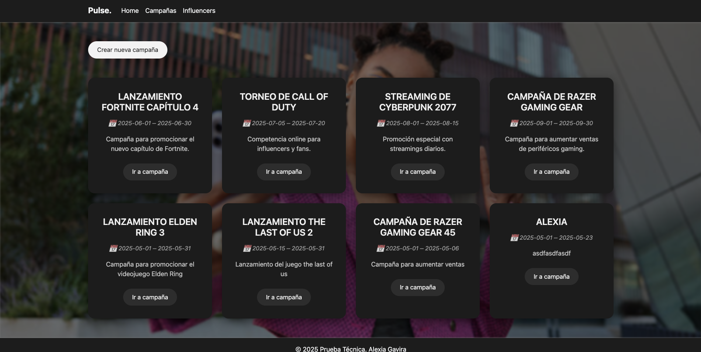
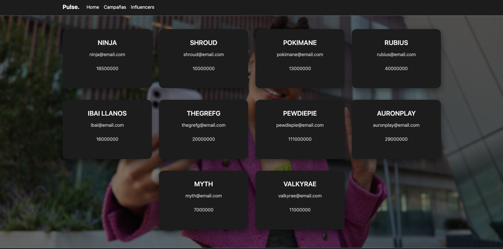
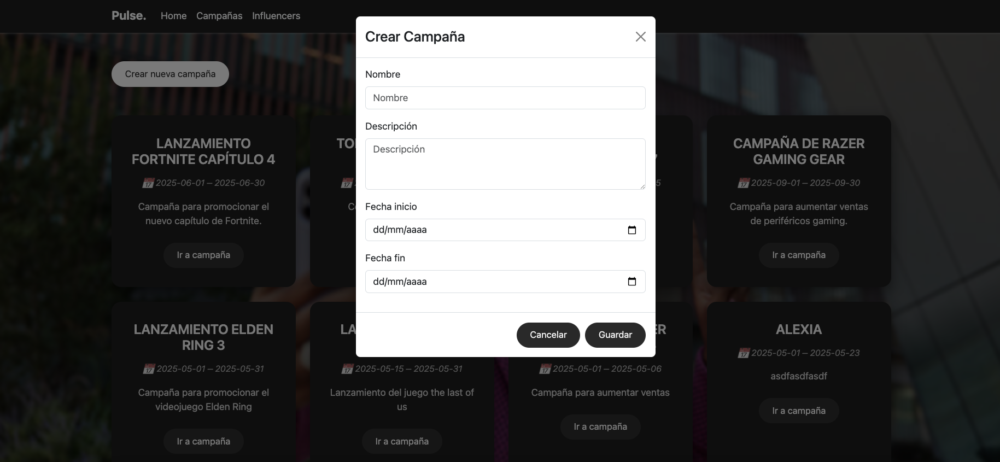
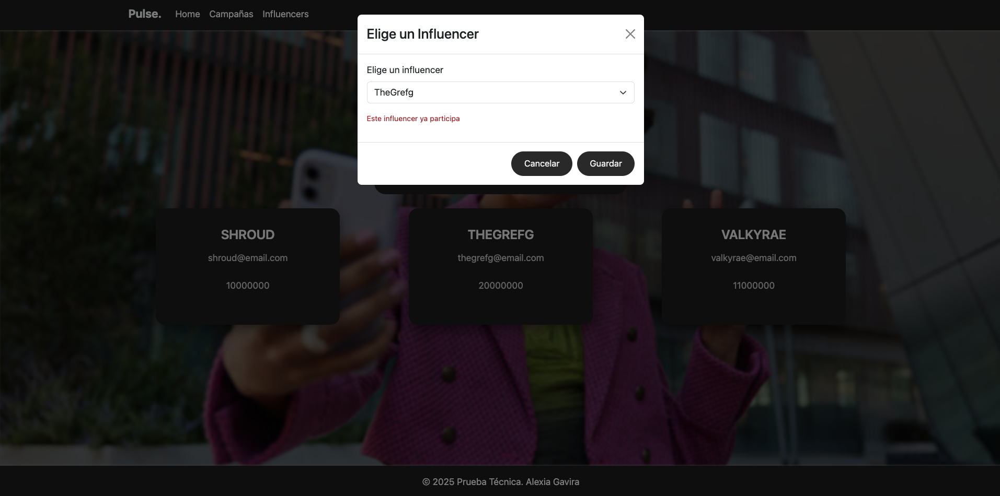
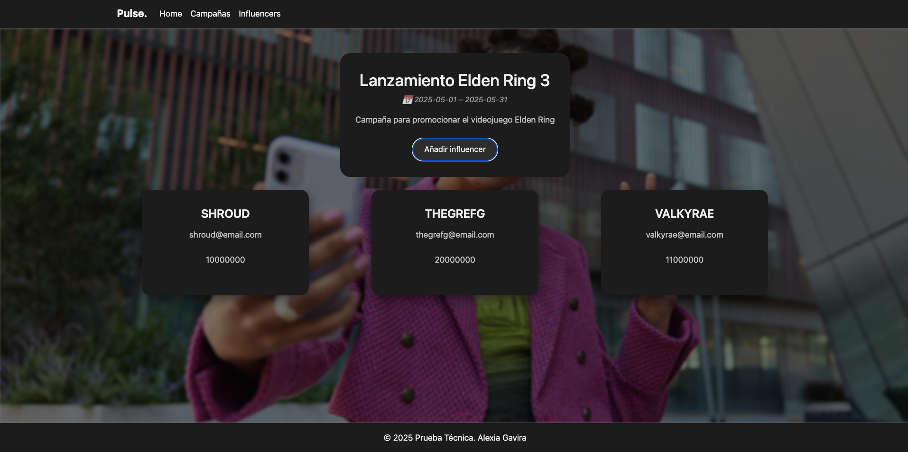

# 🚀 Prueba Técnica Node.js y React

Proyecto fullstack diseñado para evaluar habilidades tanto en frontend como en backend con tecnologías modernas. Diseño propio cuando el UI/UX. 
(Realizado en 4 horas)

---

## 📖 Descripción

Este proyecto consiste en una aplicación web dividida en dos partes principales:

- 🖥️ **client/** — Interfaz de usuario desarrollada con React + Vite.
- 🔧 **server/** — API REST construida con Node.js, Express y MySQL.

---
## 🧩 Funcionalidades

La aplicación permite realizar las siguientes acciones:

- 📝 **Crear una campaña de marketing**  
  Define el nombre, fechas de inicio y de fin y descripción de una nueva campaña.
  Incluye validaciones con Zod.

- 📋 **Listar campañas existentes**  
  Visualiza todas las campañas registradas con sus detalles.

- 📋 **Listar influencers existentes**  
  Visualiza todos los influencers registradas con sus detalles.

- 🔗 **Asociar un influencer a una campaña**  
  Relaciona un influencer con una campaña específica.
  Validaciones para no poder asignar un influencer que ya está asociado a esa campaña.
  
---

## 🛠️ Tecnologías utilizadas

### 🧩 Frontend

- ⚛️ **React** 
- ⚡ **Vite** 
- 🎨 **Bootstrap** y **CSS**

### 🖥️ Backend

- 🟢 **Node.js** 
- 🚂 **Express.js** 
- 🧠 **ES6** 
- 🗄️ **MySQL** 

---

## 🚀 Despliegue del Proyecto


### ✅ 1. Instala Node.js
Descárgalo desde: [https://nodejs.org](https://nodejs.org)


### 🛠️ 2. Instala MySQL y MySQL Workbench
Descarga e instala desde: [https://dev.mysql.com/downloads/](https://dev.mysql.com/downloads/)


### 📦 3. Clona el repositorio

Clona este repositorio en tu PC local y accede a la carpeta del proyecto:

```bash
git clone https://github.com/Alexiag7/Pulse-React-Node.git
cd Pulse-React-Node
```

### 📥 4. Instalar dependencias en el cliente (frontend) y servidor (backend)

Dentro de la carpeta del proyecto, ejecuta el siguiente comando para instalar todas las dependencias necesarias:

```bash
cd client
npm install
```

```bash
cd server
npm install
```

### 🗄️ 5. Crea la base de datos en MySQL

Abre MySQL Workbench
Ejecuta el script SQL db.sql

### ▶️ 6. Levantar el cliente y el servidor en dos terminales

Para iniciar la aplicación en modo desarrollo, ejecuta el siguiente comando:

```bash
cd client
npm run dev
```

```bash
cd server
npm run dev
```

### 🌐 8. Abre en el navegador

Accede a la app desde:
http://localhost:5173

---

## 📸 Capturas app








